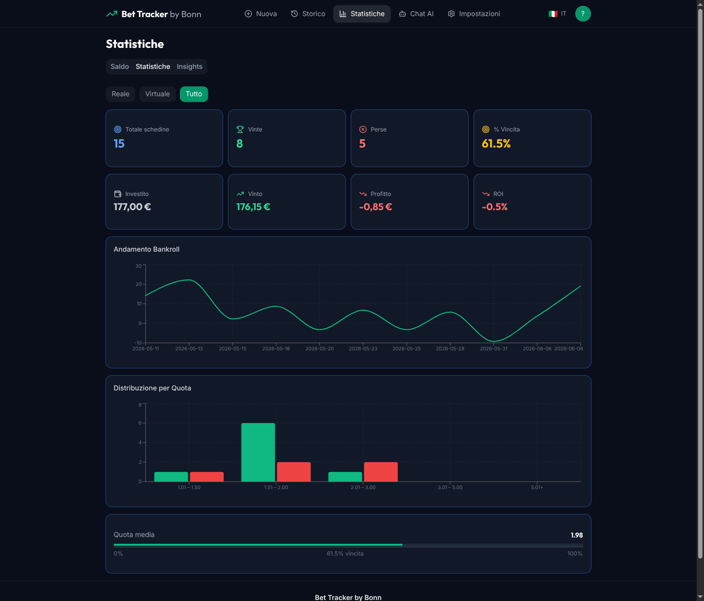
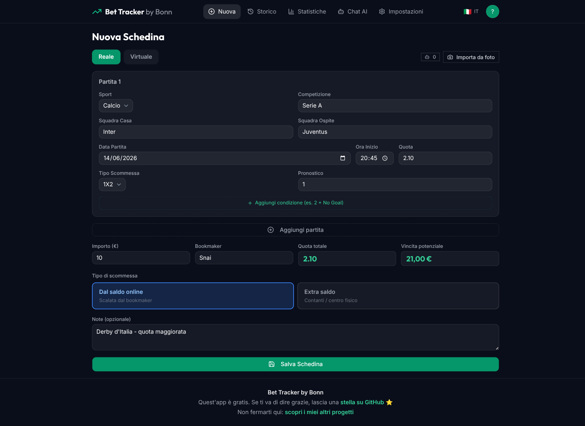
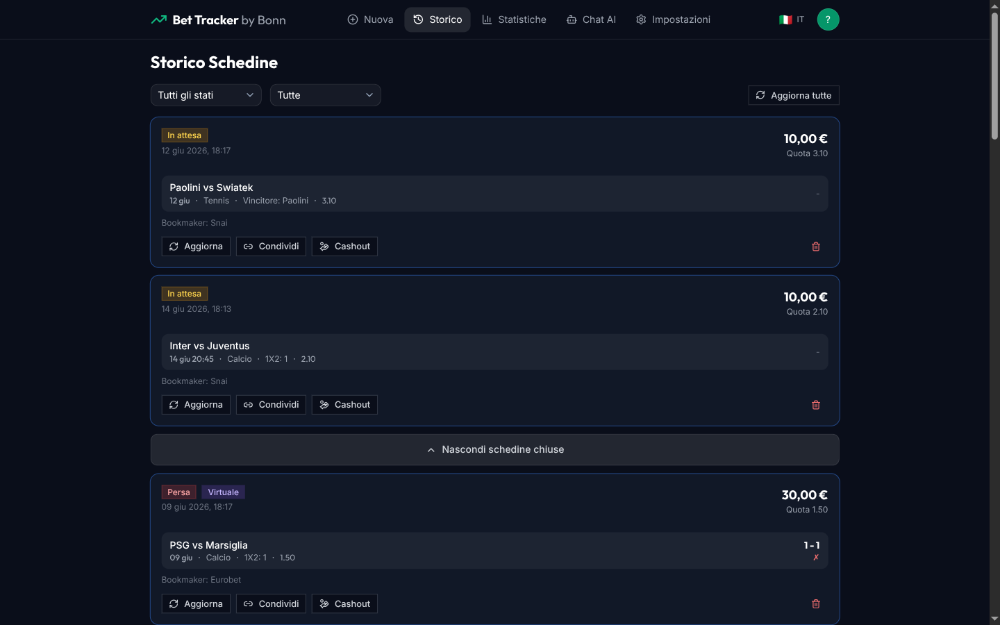
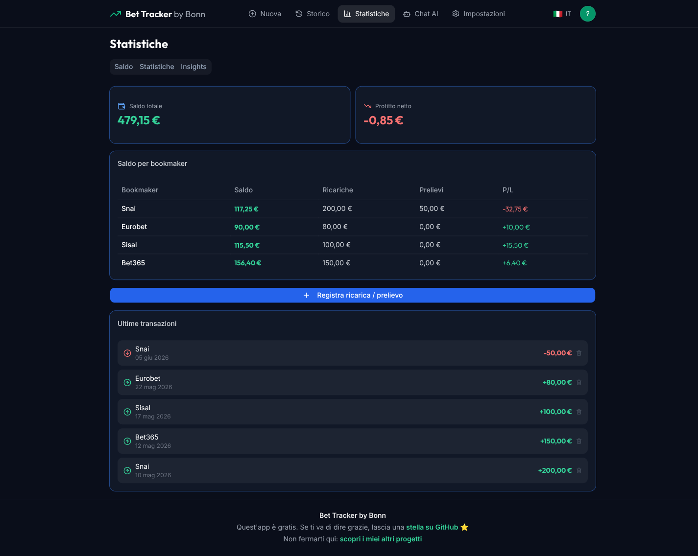
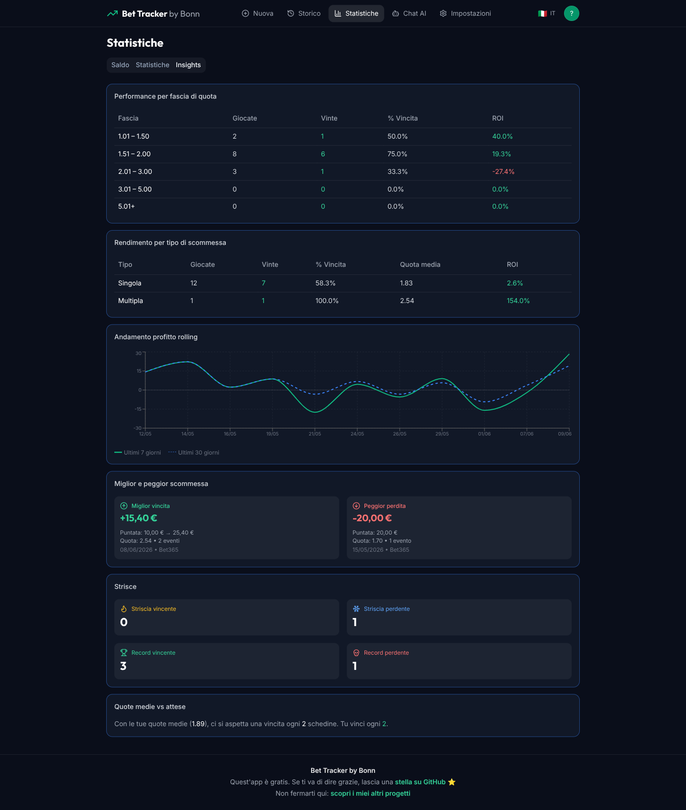
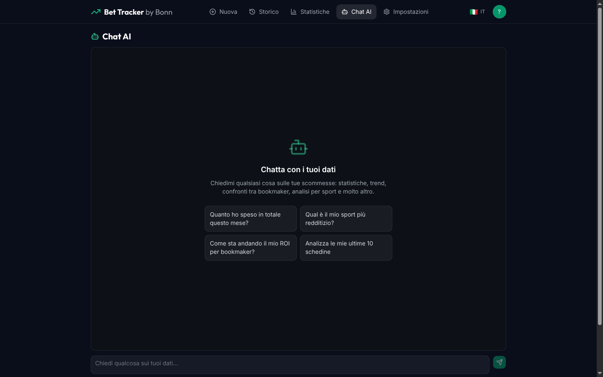
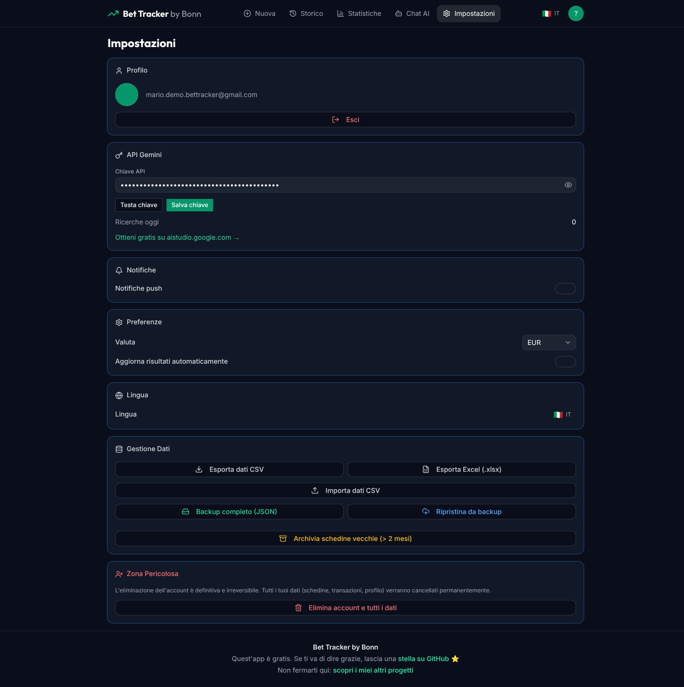
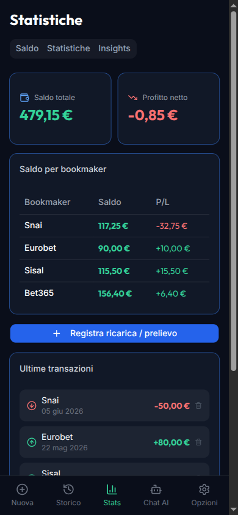
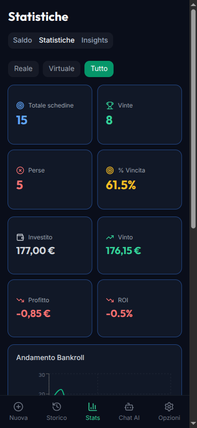

  

<h1 align="center">Bet Tracker by Bonn</h1>

  <strong>Traccia, analizza e migliora le tue performance nelle scommesse sportive.</strong> 
  Una Progressive Web App gratuita, nessun download richiesto.

  

  
  
  
  
  

  <a href="README.md">English</a> · <a href="SECURITY.it.md">Sicurezza</a>

  

---

## Indice

- [Cos'è Bet Tracker?](#cosè-bet-tracker)
- [Funzionalità](#funzionalità)
- [Come si Usa](#come-si-usa)
- [Requisiti](#requisiti)
- [Stack Tecnologico](#stack-tecnologico)
- [Privacy e Sicurezza](#privacy-e-sicurezza)
- [Licenza](#licenza)
- [Autore](#autore)
- [Sostieni il progetto](#sostieni-il-progetto)

---

## Cos'è Bet Tracker?

Bet Tracker è un tracker personale per scommesse sportive che ti aiuta a capire le tue abitudini di gioco attraverso i dati. Non incoraggia il gioco d'azzardo. Ti offre un quadro chiaro e onesto dei tuoi risultati per prendere decisioni consapevoli.

Che tu scommetta con soldi veri o voglia solo simulare senza rischiare nulla, Bet Tracker tiene tutto in un unico posto: le tue schedine, i saldi dei bookmaker, le statistiche di performance e l'analisi con intelligenza artificiale.

---

## Funzionalità

### Nuova Schedina
Crea scommesse singole o multiple con tutti i dettagli: squadre, sport, competizione, tipo di scommessa, quota, importo e bookmaker. Scegli tra modalità **Reale** (soldi veri) e **Virtuale** (simulazione).

  

### Importa da Screenshot (AI)
Scatta una foto della tua schedina da qualsiasi app di bookmaker. Bet Tracker usa **Gemini AI** per estrarre automaticamente tutte le partite, le quote, l'importo e il nome del bookmaker, così salti l'inserimento manuale.

### Storico
Consulta tutte le tue schedine con filtri per stato (Vinta / Persa / In Attesa), modalità (Reale / Virtuale) e bookmaker. Aggiorna i risultati, registra le vincite effettive o condividi le schedine con amici tramite un link pubblico unico.

  

### Statistiche
Tre tab dedicate ti danno un quadro completo delle performance:

| Tab | Cosa mostra |
|-----|-------------|
| **Saldo** | Saldo corrente per bookmaker, P&L totale, storico ricariche/prelievi |
| **Statistiche** | Schedine totali, % vincita, ROI, investito vs vinto, grafico andamento bankroll, distribuzione quote |
| **Insights** | Performance per fascia di quota, confronto singola vs multipla, grafico profitto rolling 7/30 giorni, miglior e peggior scommessa, strisce di vittorie/sconfitte, % vincita attesa vs reale |

  
  

### Assistente AI Chat
Fai domande sui tuoi dati in linguaggio naturale. Alimentato da **Gemini 2.5 Flash**, l'assistente analizza il tuo storico reale e risponde a domande come:
- *"Come sto andando nel calcio rispetto al basket?"*
- *"Qual è il mio ROI sulle multiple sopra quota 3.00?"*
- *"Confronta i miei risultati tra i vari bookmaker"*

L'AI analizza solo i tuoi dati. Non dà mai consigli di scommessa o pronostici.

  

### Condividi Schedine
Genera un link pubblico condivisibile per qualsiasi schedina. Gli amici possono vedere i dettagli delle partite, le quote e i risultati senza un account. Un contatore traccia quante persone l'hanno visualizzata.

### Impostazioni
- **Profilo**: info account Google e logout
- **Chiave API Gemini**: configura la tua chiave gratuita per le funzionalità AI (import screenshot + chat)
- **Notifiche**: toggle notifiche push
- **Preferenze**: valuta (EUR/USD/GBP), aggiornamento automatico risultati
- **Lingua**: italiano e inglese con rilevamento automatico della lingua del browser
- **Gestione Dati**: esporta in CSV o Excel, importa da CSV, backup e ripristino JSON completo, archivia schedine vecchie
- **Eliminazione Account**: cancella definitivamente tutti i dati con doppia conferma

  

---

## Come si Usa

### 1. Accedi
Apri [bettracker-bybonn.web.app](https://bettracker-bybonn.web.app) e accedi con il tuo account Google. Nessun modulo di registrazione, nessuna verifica email.

### 2. Configura la Chiave AI (Opzionale)
Vai in **Impostazioni** e incolla la tua chiave Gemini gratuita (ottienine una su [aistudio.google.com](https://aistudio.google.com)). Questo sblocca l'importazione da screenshot e l'assistente AI.

### 3. Aggiungi la Prima Schedina
- Tocca **Nuova Schedina**
- Scegli la modalità **Reale** o **Virtuale**
- Aggiungi una o più partite con sport, squadre, tipo di scommessa e quota
- Inserisci l'importo e il bookmaker
- Salva

In alternativa, usa **Importa da Foto** per far leggere all'AI lo screenshot del tuo bookmaker.

### 4. Aggiorna i Risultati
Quando una scommessa si risolve, vai nello **Storico**, aggiorna lo stato (Vinta/Persa) e inserisci la vincita effettiva. Le statistiche e il saldo si aggiornano automaticamente.

### 5. Gestisci il Bankroll
In **Statistiche > Saldo**, registra ricariche e prelievi per ogni bookmaker. Bet Tracker calcola il profitto netto per bookmaker e complessivo.

### 6. Analizza le Performance
Controlla **Statistiche** e **Insights** per capire dove vinci, dove perdi e come la tua strategia si evolve nel tempo.

### 7. Installa come App (Opzionale)
Bet Tracker è una PWA. Su mobile, tocca "Aggiungi alla schermata Home" per un'esperienza simile a un'app nativa. Funziona offline per consultare i tuoi dati.

  
  &nbsp;&nbsp;
  

---

## Requisiti

| Requisito | Dettagli |
|-----------|----------|
| **Browser** | Qualsiasi browser moderno (Chrome, Safari, Firefox, Edge) |
| **Account** | Account Google per l'autenticazione |
| **Funzionalità AI** | Chiave API Gemini gratuita ([ottienila qui](https://aistudio.google.com)) |
| **Costo** | Completamente gratuito |

---

## Stack Tecnologico

Bet Tracker è una single-page application costruita con:

| Livello | Tecnologia |
|---------|------------|
| **Frontend** | React 18, TypeScript 5.6, Vite 6 |
| **Stile** | Tailwind CSS 3, componenti shadcn/ui, icone Lucide |
| **Stato** | Zustand (globale), React Query (stato server) |
| **Backend** | Firebase Authentication (Google OAuth), Cloud Firestore (database), Firebase Hosting |
| **AI** | Google Gemini 2.5 Flash (chat + visione OCR) |
| **Grafici** | Recharts |
| **Form** | React Hook Form + validazione Zod |
| **i18n** | i18next con rilevamento automatico lingua browser |
| **PWA** | vite-plugin-pwa, Service Worker, supporto offline |
| **Export Dati** | CSV, XLSX (SheetJS), backup/ripristino JSON |

### Aspetti Architetturali
- **Design mobile-first responsive** con tema scuro
- **Sicurezza a livello di riga** tramite regole Firestore, così gli utenti accedono solo ai propri dati
- **Salvataggio chiavi lato client**: le chiavi API Gemini sono salvate nel profilo Firestore dell'utente, mai esposte ad altri utenti
- **Funzionamento offline**: caching IndexedDB tramite `idb` per la navigazione offline
- **Zero codice backend**: architettura serverless su Firebase

---

## Privacy e Sicurezza

I tuoi dati sono tuoi. Bet Tracker salva tutto nel tuo account Firebase personale, protetto da autenticazione Google e regole di sicurezza Firestore. Nessuno, incluso lo sviluppatore, può accedere ai tuoi dati di scommessa.

Per tutti i dettagli, consulta la [Policy di Sicurezza](SECURITY.it.md).

---

## Licenza

Questo progetto è rilasciato con una [licenza personalizzata](LICENSE). L'app è gratuita per uso personale.

---

## Autore

**Andrea Bonacci** ([GitHub](https://github.com/AndreaBonn))

---

## Sostieni il progetto

Bet Tracker è gratuita. Se ti è utile e vuoi contribuire, puoi lasciare un'offerta tramite PayPal. L'importo lo scegli tu ed è del tutto facoltativo.

  

Se preferisci non donare, anche una stella sulla [repository GitHub](https://github.com/AndreaBonn/BetTracker-by-Bonn) aiuta altre persone a scoprire il progetto.

---

  Bet Tracker non incoraggia il gioco d'azzardo. È uno strumento di tracciamento personale. Gioca responsabilmente.

